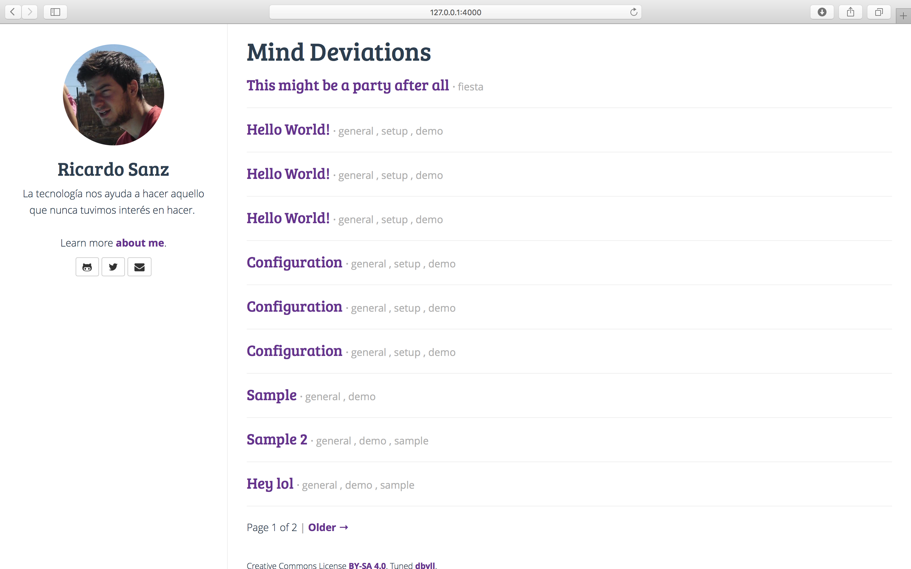

This is a modified dbyll
=====

Open source stylish, minimalistic theme for jekyll.  
Original: http://dbtek.github.io/dbyll/

### Features
- Responsive layout.
- Only one kind of tags.
- Social profile and bio of author.
- Bootstrap based.
- Glyphicon and Font-Awesome Icons.
- Pagination.
- Disqus comments.

### Download
* [Download original dbyll](https://github.com/dbtek/dbyll/archive/master.zip)

### Install
- You need to have [ruby](https://www.ruby-lang.org/en/documentation/installation/) installed in your system.
- Install bundler which helps in specifying and installing dependencies of any Ruby project. ```gem install bundler```
- Go to the root of the repo and run this - ```bundle install```
- Then - ```bundle exec jekyll serve```

### Screenshots


### License
- [MIT](http://opensource.org/licenses/MIT)


[](https://bitdeli.com/free "Bitdeli Badge")
